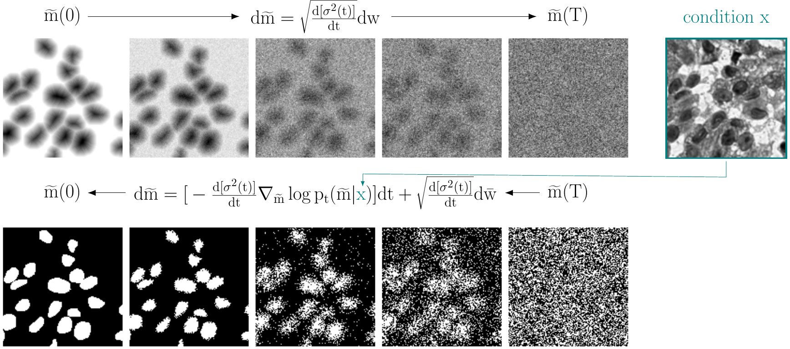

 
**Score-Based Generative Models for Medical Image Segmentation using Signed Distance Functions**<br>
GCPR 2023<br>
Lea Bogensperger, Dominik Narnhofer, Filip Ilic, Thomas Pock<br>

---

[[Project Page]](https://github.com/leabogensperger/generative-segmentation-sdf)
[[Paper]](https://arxiv.org/abs/2303.05966)

The source code will be published soon.


# Score-Based Generative Models for Medical Image Segmentation using Signed Distance Functions

This repository consists of ...



# Sampling

The sampling process of the proposed approach is shown using the predictor-corrector sampling algorithm (see Algorithm 1 in the paper). 
In the top row there are four different condition images and the center row contains the generated/predicted SDF masks. 
Further, the bottom row displays the corresponding binary masks, which are obtained only indirectly from thresholding the predicted SDF masks. 


# Requirements 

todo 


# Cite
change this once the proceedings are out

```bibtex
@misc{
    bogensperger2023scorebased,
    title={Score-Based Generative Models for Medical Image Segmentation using Signed Distance Functions}, 
    author={Lea Bogensperger and Dominik Narnhofer and Filip Ilic and Thomas Pock},
    year={2023},
    eprint={2303.05966},
    archivePrefix={arXiv},
    primaryClass={cs.CV}
}
